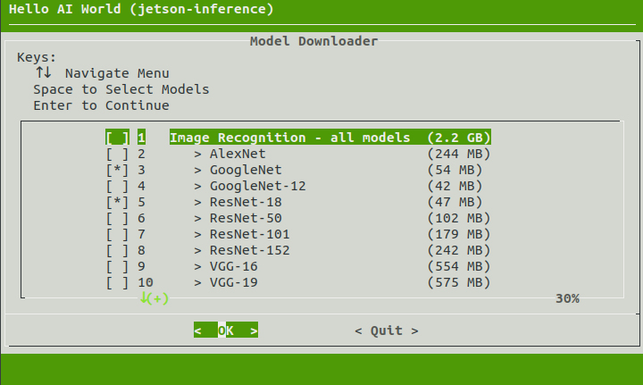
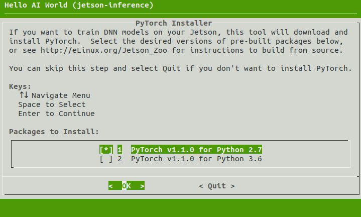
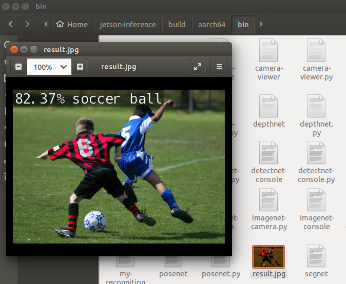

# jetson-inference 프로젝트

- https://github.com/dusty-nv/jetson-inference
- NVIDIA의 공식 프로젝트. 
- 소스에서 빌드할 수도 있고, 이미 빌드된 docker를 사용할 수도 있다.
- 특정 모델을 선택하여 다운로드하여 실행함.
- 생성된 python 실행파일로 물체 분류(classification), 물체 탐지(object detection), 영역 분할(segmentation), 깊이 탐지(depth detection) 실행

<br>

# 프로젝트 전체 내용

- jetson 셋업. 소스 빌드하거나 docker를 사용
- 분류, 탐지, 분할, 포즈추출 할 수 있고
- 데이터 가져와서 분류 학습할 수 있고
- 혹은 분류, 탐지(SSD) 데이터 새로 만들어 학습

<br>

# Jetson 셋업

[Jetson 셋업](jetson_setup.pdf)의 방법으로 Jetson을 부팅상태로 한다.

<br>

# 소스에서 빌딩

[https://github.com/dusty-nv/jetson-inference/blob/master/docs/building-repo-2.md](https://github.com/dusty-nv/jetson-inference/blob/master/docs/building-repo-2.md)를 기반으로 함.

<br>

## 필요 프로그램, 라이브러리 설치

```bash
$ sudo apt-get update
$ sudo apt-get install git cmake libpython3-dev python3-numpy
```

<br>

## 프로젝트 다운로드

```bash
$ git clone https://github.com/dusty-nv/jetson-inference
$ cd jetson-inference
$ git submodule update --init
```

<br>

## cmake 빌드

```bash
$ cd ~/jetson-inference
$ mkdir build
$ cd build
$ cmake ../
```

<br>

## 모델 다운로드

cmake가 종료되면 자동으로 다음이 실행된다.



다운로드 할 모델을 스페이스바 눌러서 선택하고 엔터 클릭하여 다운로드 실행.

수동으로 실행시키려면 다음을 실행.

```bash
$ cd ~/jetson-inference/tools
$ ./download-models.sh
```

<br>

## PyTorch 설치

다운로드 완료되면 다음이 자동으로 실행된다.



아래에 있는 'PyTorch v.1.4.0 for Python 3.6'에서 스페이스바 클릭, 엔터 클릭.

자동으로 실행되지 않으면 다음으로 실행시킨다.

```bash
$ cd ~/jetson-inference/build
$ ./install-pytorch.sh
```

<br>

## 컴파일/설치

```bash
$ make
$ sudo make install
$ sudo ldconfig
```

빌드된 것들이 aarch64/bin에 설치됨.

<br>

## 실행

파일 대상 분류

```bash
$ cd aarch64/bin
$ ./imagenet-console.py images/humans_0.jpg result.jpg
```

결과는 result.jpg로 저장된다. ubuntu의 윈도우 탐색기(?)로 확인 가능하다.


<br>

실시간 카메라 대상 분류

```bash
$ cd aarch64/bin
$ ./imagenet-camera.py 
```

윈도우 창이 뜨면서 실시간으로 분류 실행됨.

<br>

# Docker로 환경 준비

[https://github.com/dusty-nv/jetson-inference/blob/master/docs/aux-docker.md](https://github.com/dusty-nv/jetson-inference/blob/master/docs/aux-docker.md)를 기반으로 함.

<br>

## 프로젝트 다운로드

```bash
$ git clone --recursive https://github.com/dusty-nv/jetson-inference

```

<br>

## docker 실행

```bash
$ cd jetson-inference
$ docker/run.sh
```
10여분 소요된다.

소스에서 빌드한 build/aarch64/bin의 내용이 존재한다.

그리고 docker 컨테이너외부와 파일 공유를 위해 다음의 디렉토리가 마운트 되었다.
```bash
/jetson-inference/
	data/
	python/
		training/
			classification/
				data/
				models/
			detection/
				data/
				models/
```
외부의 ~/jetson-inference 가 docker 내의 /jetson-inference로 마운트 되었다.


<br>

## 동작 확인

```bash
$ cd build/aarch64/bin
$ ./imagenet images/jellyfish.jpg images/test/result.jpg
```

<br>

## build/aarch64/bin 밑의 파일 들

```bash
detectnet-camera.py  # detectnet.py와 동일. 카메라 동영상에 대해
detectnet-console.py # detectnet.py와 동일. 파일에 대해
detectnet.py         # 카메라 동영상 혹은 파일에 대해

imagenet-camera.py  # imagenet.py와 동일. 카메라 동영상에 대해
imagenet-console.py # imagenet.py와 동일. 파일에 대해
imagenet.py         # 카메라 동영상 혹은 파일에 대해

segnet-camera.py    # segnet.py와 동일
segnet-console.py   # segnet.py와 동일
segnet.py           # 카메라 동영상 혹은 파일에 대해

posenet.py          # 포즈 추출

video-viewer.py
caemra-viewr.py

my-detection.py     # object detection 코드 template
my-recognition.py   # classification 코드 template
```

<br>

# 분류(classification)


## default 모델로 실행

default model로 실행

```bash
$ ./imagenet.py images/orange_0.jpg images/test/output_0.jpg
```

<br>

## 특정 모델로 실행

```bash
$ ./imagenet.py --network=resnet-18 images/jellyfish.jpg images/test/output_jellyfish.jpg
```

모델 다운로드는 tools/download-models.sh로 할 수 있다.

model CLI 값
| Network | CLI argument |
|---------|--------------|
| AlexNet | alexnet |
| GoogleNet | googlenet |
| GoogleNet-12 | googlenet-12 |
| ResNet-18 | resnet-18 |
| ResNet-50 | resnet-50 |
| ResNet-101 | resnet-101 |
| ResNet-152 | resnet-152 |
| VGG-16 | vgg-16 |
| VGG-19 | vgg-19 |
| Inception-v4 | inception-v4 |

<br>

## 카메라에 대하여 실행

[https://github.com/dusty-nv/jetson-inference/blob/master/docs/imagenet-camera-2.md](https://github.com/dusty-nv/jetson-inference/blob/master/docs/imagenet-camera-2.md) 기반으로 함

```bash
./imagenet.py csi://0
```

장치를 검색하면 /dev/video0으로 잡히지만 다음으로 실행하면 안되고 'csi://0'으로 해야 한다.

```bash
./imagenet.py /dev/video0
```

<br>

## 동영상 파일에 대하여 실행

```bash
$ wget https://nvidia.box.com/shared/static/tlswont1jnyu3ix2tbf7utaekpzcx4rc.mkv -O jellyfish.mkv

$ ./imagenet.py --network=resnet-18 jellyfish.mkv images/test/jellyfish_resnet18.mkv
```

<br>

## imagenet.py 내용

```python

import jetson.inference
import jetson.utils

import argparse
import sys


# parse the command line
parser = argparse.ArgumentParser(description="Classify a live camera stream using an image recognition DNN.", 
                                 formatter_class=argparse.RawTextHelpFormatter, epilog=jetson.inference.imageNet.Usage() +
                                 jetson.utils.videoSource.Usage() + jetson.utils.videoOutput.Usage() + jetson.utils.logUsage())

parser.add_argument("input_URI", type=str, default="", nargs='?', help="URI of the input stream")
parser.add_argument("output_URI", type=str, default="", nargs='?', help="URI of the output stream")
parser.add_argument("--network", type=str, default="googlenet", help="pre-trained model to load (see below for options)")
parser.add_argument("--camera", type=str, default="0", help="index of the MIPI CSI camera to use (e.g. CSI camera 0)\nor for VL42 cameras, the /dev/video device to use.\nby default, MIPI CSI camera 0 will be used.")
parser.add_argument("--width", type=int, default=1280, help="desired width of camera stream (default is 1280 pixels)")
parser.add_argument("--height", type=int, default=720, help="desired height of camera stream (default is 720 pixels)")
parser.add_argument('--headless', action='store_true', default=(), help="run without display")

is_headless = ["--headless"] if sys.argv[0].find('console.py') != -1 else [""]

try:
	opt = parser.parse_known_args()[0]
except:
	print("")
	parser.print_help()
	sys.exit(0)


# 모델 로딩. default는 'googlenet'
# load the recognition network
net = jetson.inference.imageNet(opt.network, sys.argv)

# 파일이든 동영상이든 카메라든 관계 없다.
# create video sources & outputs
input = jetson.utils.videoSource(opt.input_URI, argv=sys.argv)
output = jetson.utils.videoOutput(opt.output_URI, argv=sys.argv+is_headless)
font = jetson.utils.cudaFont()

# process frames until the user exits
while True:
	# capture the next image
	img = input.Capture()

	# 탐지 결과는 class id와 신뢰도(confidence)이다.
	# classify the image
	class_id, confidence = net.Classify(img)

	# class id에 대한 class 이름
	# find the object description
	class_desc = net.GetClassDesc(class_id)

	# overlay the result on the image	
	font.OverlayText(img, img.width, img.height, "{:05.2f}% {:s}".format(confidence * 100, class_desc), 5, 5, font.White, font.Gray40)
	
	# render the image
	output.Render(img)

	# update the title bar
	output.SetStatus("{:s} | Network {:.0f} FPS".format(net.GetNetworkName(), net.GetNetworkFPS()))

	# print out performance info
	net.PrintProfilerTimes()

	# 입력이나 출력이 streaming이 아니면 종료한다.
	# exit on input/output EOS
	if not input.IsStreaming() or not output.IsStreaming():
		break

```

<br>

# 물체탐지(object detection)

## default 모델 사용

```bash
$ ./detectnet.py images/peds_0.jpg images/test/output.jpg
```

<br>

## 특정 모델 사용

```bash
$ ./detectnet.py --network=ssd-mobilenet-v2 images/peds_0.jpg images/test/output.jpg
```

model CLI 값
| model | CLI argument | dataset |
|-------|--------------|---------|
| SSD-Mobilenet-v1 | ssd-mobilenet-v1 | 91 (COCO classes) |
| SSD-Mobilenet-v2 | ssd-mobilenet-v2 | 91 (COCO classes) |
| SSD-Inception-v2 | ssd-inception-v2 | 91 (COCO classes) |
| DetectNet-COCO-Dog | coco-dog | dogs |
| DetectNet-COCO-Bottle | coco-bottle | bottles |
| DetectNet-COCO-Chair | coco-chair | chairs |
| DetectNet-COCO-Airplane | coco-airplane | airplanes |
| ped-100 | pednet | pedestrians |
| multiped-500 | multiped | pedestrians, luggage |
| facenet-120 | facenet | faces |

<br>

## 디렉토리 내 여러개 파일

```bash
$ ./detectnet.py "images/peds_*.jpg" images/test/peds_output_%i.jpg
```

<br>

## 동영상 파일

```bash
$ cp /usr/share/visionworks/sources/data/pedestrians.mp4 images/
$ cp /usr/share/visionworks/sources/data/parking_ssd.avi images/
```

```bash
$ ./detectnet.py images/pedestrians.mp4 images/test/pedestrians_ssd.mp4

$ ./detectnet.py images/parking.avi images/test/parking_ssd.avi
```

<br>

## 카메라 사용

```bash
$ ./detectnet.py csi://0
```

<br>

## detectnet.py 내용

```bash
import jetson.inference
import jetson.utils

import argparse
import sys

# parse the command line
parser = argparse.ArgumentParser(description="Locate objects in a live camera stream using an object detection DNN.")

parser.add_argument("input_URI", type=str, default="", nargs='?', help="URI of the input stream")
parser.add_argument("output_URI", type=str, default="", nargs='?', help="URI of the output stream")
parser.add_argument("--network", type=str, default="ssd-mobilenet-v2", help="pre-trained model to load (see below for options)")
parser.add_argument("--overlay", type=str, default="box,labels,conf", help="detection overlay flags (e.g. --overlay=box,labels,conf)\nvalid combinations are:  'box', 'labels', 'conf', 'none'")
parser.add_argument("--threshold", type=float, default=0.5, help="minimum detection threshold to use") 

try:
	opt = parser.parse_known_args()[0]
except:
	print("")
	parser.print_help()
	sys.exit(0)

# 모델 로딩. default는 'ssd-mobilenet-v2'
# load the object detection network
net = jetson.inference.detectNet(opt.network, sys.argv, opt.threshold)

# 파일이든 동영상이든 카메라든 관계 없다.
# create video sources & outputs
input = jetson.utils.videoSource(opt.input_URI, argv=sys.argv)
output = jetson.utils.videoOutput(opt.output_URI, argv=sys.argv)

# process frames until the user exits
while True:
	# capture the next image
	img = input.Capture()

	# 탐지 결과는 img에 그려져 있고, 개별 결과는 detections에 담겨 있다.
	detections = net.Detect(img, overlay=opt.overlay)

	# 콘솔에 출력하고
	print("detected {:d} objects in image".format(len(detections))
	for detection in detections:
		print(detection)

	# 결과를 출력하고
	output.Render(img)

	# update the title bar
	output.SetStatus("{:s} | Network {:.0f} FPS".format(opt.network, net.GetNetworkFPS()))

	# print out performance info
	net.PrintProfilerTimes()

	# 입력이나 출력이 streaming이 아니면 종료한다.
	# exit on input/output EOS
	if not input.IsStreaming() or not output.IsStreaming():
		break
```

<br>

## python 코드 작성

```bash
import jetson.inference
import jetson.utils

net = jetson.inference.detectNet("ssd-mobilenet-v2", threshold=0.5)
camera = jetson.utils.videoSource("csi://0")      # '/dev/video0' for V4L2
display = jetson.utils.videoOutput("display://0") # 'my_video.mp4' for file

while display.IsStreaming():
	img = camera.Capture()
	detections = net.Detect(img)
	display.Render(img)
	display.SetStatus("Object Detection | Network {:.0f} FPS".format(net.GetNetworkFPS()))
```

<br>

# 영역분할(segmentation)

<br>

## default 모델 사용

```bash
$ ./segnet.py images/city_0.jpg images/test/output.jpg

$ ./segnet.py --alpha=200 images/city_0.jpg images/test/output.jpg

$ ./segnet.py --visualize=maskimages/city_0.jpg images/test/output.jpg
```

<br>

## 특정 모델 사용

```bash
$ ./segnet.py --network=fcn-resnet18-cityscapes images/city_0.jpg images/test/output.jpg
```

model CLI 값
| Dataset	| Resolution	| CLI Argument	| Accuracy	| FPS	|
|---------|-------------|---------------|-----------|-----|
| Cityscapes	| 512x256	| fcn-resnet18-cityscapes-512x256	| 83.3%	| 48 FPS	|
| Cityscapes	| 1024x512	| fcn-resnet18-cityscapes-1024x512	| 87.3%	| 12 FPS	|
| Cityscapes	| 2048x1024	| fcn-resnet18-cityscapes-2048x1024	| 89.6%	| 3 FPS	|
| DeepScene	| 576x320	| fcn-resnet18-deepscene-576x320	| 96.4%	| 26 FPS	|
| DeepScene	| 864x480	| fcn-resnet18-deepscene-864x480	| 96.9%	| 14 FPS	|
| Multi-Human	| 512x320	| fcn-resnet18-mhp-512x320	| 86.5%	| 34 FPS	|
| Multi-Human	| 640x360	| fcn-resnet18-mhp-640x360	| 87.1%	| 23 FPS	|
| Pascal VOC	| 320x320	| fcn-resnet18-voc-320x320	| 85.9%	| 45 FPS	|
| Pascal VOC	| 512x320	| fcn-resnet18-voc-512x320	| 88.5%	| 34 FPS	|
| SUN RGB-D	| 512x400	| fcn-resnet18-sun-512x400	| 64.3%	| 28 FPS	|
| SUN RGB-D	| 640x512	| fcn-resnet18-sun-640x512	| 65.1%	| 17 FPS	|

<br>

### 폴더 파일 전체에 대해

```bash
$ ./segnet.py --network=fcn-resnet18-sun "images/room_*.jpg" images/test/room_output_%i.jpg
```

<br>

## 카메라 동영상에 대해

```bash
~ ./senet.py csi://0
```

<br>

# 포즈추출(pose estimation)

<br>

## default 모델로

```bash
./posenset.py images/human_9.jpg images/test/human_9_pose.jpg
```

<br>

## 특정 모델로

```bash
./posenset.py --network=resnet18-body images/human_9.jpg images/test/human_9_pose.jpg
```

model CLI 값
| Model	| CLI argument	| NetworkType enum	| Keypoints |
|-------|---------------|-------------------|-----------|
| Pose-ResNet18-Body	| resnet18-body	| RESNET18_BODY	| 18 | 
| Pose-ResNet18-Hand	| resnet18-hand	| RESNET18_HAND	| 21 | 
| Pose-DenseNet121-Body	| densenet121-body	| DENSENET121_BODY	| 18 |

<br>

## 폴더 파일 전체에 대해

```bash
$ ./posenet.py "images/humans_*.jpg" images/test/pose_humans_%i.jpg
```

<br>

## 카메라 동영상에 대해

```bash
./posenet.py csi://0
```

<br>

## posent.py

```python
...

while True:
    # capture the next image
    img = input.Capture()

    # perform pose estimation (with overlay)
    poses = net.Process(img, overlay=opt.overlay)

    # print the pose results
    print("detected {:d} objects in image".format(len(poses)))

    for pose in poses:
        print(pose)
        print(pose.Keypoints)
        print('Links', pose.Links)

...
```

## 코드로 값 구하기

```bash
poses = net.Process(img)

for pose in poses:
    # find the keypoint index from the list of detected keypoints
    # you can find these keypoint names in the model's JSON file, 
    # or with net.GetKeypointName() / net.GetNumKeypoints()
    left_wrist_idx = pose.FindKeypoint('left_wrist')
    left_shoulder_idx = pose.FindKeypoint('left_shoulder')

    # if the keypoint index is < 0, it means it wasn't found in the image
    if left_wrist_idx < 0 or left_shoulder_idx < 0:
        continue
	
    left_wrist = pose.Keypoints[left_wrist_idx]
    left_shoulder = pose.Keypoints[left_shoulder_idx]

    point_x = left_shoulder.x - left_wrist.x
    point_y = left_shoulder.y - left_wrist.y

    print(f"person {pose.ID} is pointing towards ({point_x}, {point_y})")
```

<br>


# 학습 환경 준비

<br>

## 스왑 공간 마운팅

docker 밖에서

```bash
sudo systemctl disable nvzramconfig
sudo fallocate -l 4G /mnt/4GB.swap
sudo mkswap /mnt/4GB.swap
sudo swapon /mnt/4GB.swap
```

/etc/tstab에 다음줄을 추가

```bash
/mnt/4GB.swap  none  swap  sw 0  0
```

<br>

## PyTorch 준비

docker 안에서 다음을 실행하여 결과 확인.

```bash
$ python

>>> import torch
>>> print(torch.__version__)
>>> print('CUDA available: ' + str(torch.cuda.is_available()))
>>> a = torch.cuda.FloatTensor(2).zero_()
>>> print('Tensor a = ' + str(a))
>>> b = torch.randn(2).cuda()
>>> print('Tensor b = ' + str(b))
>>> c = a + b
>>> print('Tensor c = ' + str(c))
```

만약 설치가 안되어 있다면 다음으로 설치.

```bash
$ cd jetson-inference/build
$ ./install-pytorch.sh
```

<br>

# cat_dog 분류 학습

[https://github.com/dusty-nv/jetson-inference/blob/master/docs/pytorch-cat-dog.md](https://github.com/dusty-nv/jetson-inference/blob/master/docs/pytorch-cat-dog.md)

<br>

## 데이터 다운로드

```bash
$ cd jetson-inference/python/training/classification/data
$ wget https://nvidia.box.com/shared/static/o577zd8yp3lmxf5zhm38svrbrv45am3y.gz -O cat_dog.tar.gz
$ tar xvzf cat_dog.tar.gz
```

파일 구조는 다음과 같다.

```bash
cat_dog/
	labels.txt
	train/
		cat/
		dog/
	val/
		cat/
		dog/
	test/
		cat/
		dog/
```

## 학습 실행

```bash
$ cd jetson-inference/python/training/classification
$ python3 train.py --model-dir=models/cat_dog data/cat_dog
```

epoch 당 7~8분, 35 epoch에 4시간

모델 저장 위치는 

```bash
# docker 밖에서 
~/jetson-inference/python/training/classification/models/cat_dog/

# docker 안에서 
/jetson-inference/python/training/classification/models/cat_dog/
	checkpoint.pth.tar
	model_best.pth.tar
```

<br>

## ONNX 포멧으로 converting

```bash
python3 onnx_export.py --model-dir=models/cat_dog
```

jetson-inference/python/training/classification/models/cat_dog/ 아래에 

resnet18.onnx 파일이 생성된다.

<br>

## 분류 실행

```bash
NET=models/cat_dog
DATASET=data/cat_dog

imagenet.py --model=$NET/cat_dog/resnet18.onnx --input_blob=input_0 --output_blob=output_0 --labels=$DATASET/labels.txt $DATASET/test/cat/01.jpg cat.jpg
```

여기서 실행되는 imagenet.py는 /usr/local/bin/imagenet.py이다.

<br>

## 전체 폴더 구조

```bash
# docker 안에서
/usr/local/bin/
	imagenet.py
	detectnet.py
	posenet.py

/jetson-inference/python/training/classification/
	train.py
	onnx_export.py
	data/
		cat_dog.tar.gz
		cat_dog/
			labels.txt
			train/
				cat/
				dog/
			val/
				cat/
				dog/
			test/
				cat/
				dog/
	models/
		cat_dog/
			checkpoint.pth.tar
			model_best.pth.tar
			resnet18.onnx
```

data/cat_dog/labels.txt 내용

```bash
cat
dog
```

<br>

# Plant 분류 학습

[https://github.com/dusty-nv/jetson-inference/blob/master/docs/pytorch-plants.md](https://github.com/dusty-nv/jetson-inference/blob/master/docs/pytorch-plants.md)

<br>

## 데이터 다운로드

```bash
$ cd jetson-inference/python/training/classification/data
$ wget https://nvidia.box.com/shared/static/vbsywpw5iqy7r38j78xs0ctalg7jrg79.gz -O PlantCLEF_Subset.tar.gz
$ tar xvzf PlantCLEF_Subset.tar.gz
```

데이터 폴더 구조

```bash
PlantCLEF_Subset/
	labels.txt
	test/
	train/
		ash/
		beech/
		...
	val/
		ash/
		beech/
		...

```

<br>

## 학습 실행

```bash
$ cd jetson-inference/python/training/classification
$ python3 train.py --model-dir=models/plants data/PlantCLEF_Subset
```

생성된 모델 파일

```bash
# docker 밖에서 
~/jetson-inference/python/training/classification/models/plants/

# docker 안에서 
/jetson-inference/python/training/classification/models/plants/
	checkpoint.pth.tar
	model_best.pth.tar
```

<br>

## ONNX 포멧으로 converting

```bash
python3 onnx_export.py --model-dir=model/plants
```

jetson-inference/python/training/classification/models/plants/ 아래에 

resnet18.onnx 파일이 생성된다.

<br>

## 분류 실행

```bash
NET=models/plants
DATASET=data/PlantCLEF_Subset

imagenet.py --model=$NET/resnet18.onnx --input_blob=input_0 --output_blob=output_0 --labels=$DATASET/labels.txt $DATASET/test/cattail.jpg cattail.jpg
```

<br>

## 전체 폴더 구조

```bash
# docker 안에서
/usr/local/bin/
	imagenet.py
	detectnet.py
	posenet.py

/jetson-inference/python/training/classification/
	train.py
	onnx_export.py
	data/
		PlantCLEF_Subset.tar.gz
		PlantCLEF_Subset/
			labels.txt
			train/
				ash/
				beech/
				...
			val/
				ash/
				beech/
				...
			test/
	models/
		platns/
			checkpoint.pth.tar
			model_best.pth.tar
			resnet18.onnx
```

data/PlantCLEF_Subset/labels.txt 내용

```bash
ash
beech
...
```

<br>

# 새로운 데이터 생성

[https://github.com/dusty-nv/jetson-inference/blob/master/docs/pytorch-collect.md](https://github.com/dusty-nv/jetson-inference/blob/master/docs/pytorch-collect.md)

<br>

## 프로그램 위치

aarch64/bin/ 혹은  tools/ 혹은 /usr/local/bin/ 에 camera-capture가 있다.

<br>

## 분류 데이터

<br>

### 실행 준비

실행하기 전에 다음을 준비한다.

```bash
$ cd /jetson-inference/python/training/classification/data
$ mkdir new_data
$ echo "class_A
class_B" > new_data/labels.txt
```

<br>

### 실행

```bash
$ camera-capture

# 또는
$ camera-capture csi://0
```


<br>

### 옵션 설정

다음 옵션을 설정한다.

- Dataset Type : 'Classification'
- Dataset Path : 'jetson-inference/python/training/classification/data/new_data'
- Class Labels : 'jetson-inference/python/training/classification/data/new_data/labels.txt'

<br>

### 캡쳐

옵션을 설정하고

- Current Set : 'train'
- Current Class : 'class_A'

버튼 'Capture (space)'를 클릭한다. 클릭하는데로 jpg파일이 생성된다.

<br>

## 물체 탐지 데이터

[https://github.com/dusty-nv/jetson-inference/blob/master/docs/pytorch-collect-detection.md](https://github.com/dusty-nv/jetson-inference/blob/master/docs/pytorch-collect-detection.md)

<br>

### 실행 준비

실행하기 전에 다음을 준비한다.

```bash
# $ cd /jetson-inference/python/training/classification/data
$ cd /jetson-inference/python/training/detection/ssd/data
$ mkdir new_data
$ echo "class_A
class_B" > new_data/labels.txt
```

classification 처럼 

detection  밑에 data 폴더가 아니라 

detection/ssd 밑에 data 폴더이다.

<br>

### 실행

```bash
$ camera-capture

# 또는
$ camera-capture csi://0
```


<br>

### 옵션 설정

다음 옵션을 설정한다.

- Dataset Type : 'Detection'
- Dataset Path : 'jetson-inference/python/training/detection/ssd/data/new_data'
- Class Labels : 'jetson-inference/python/training/detection/ssd/data/new_data/labels.txt'

<br>

### 캡쳐

옵션을 설정하고

- Current Set : 'train'
- Current Class : 'class_A'

버튼 'Freeze/Edit (space)'를 클릭한다. 

화면상에서 레이블링하고 'Save (S)'를 클릭한다.

<br>

### 버그?

새로 Freeze하면 레이블링이 안된다. 다시 Freeze해야 한다.

<br>

### 생성된 데이터 파일들

다소 복잡하다.

```bash
new_data/
	labels.txt
	Annotations/
		20210903-231110.xml
		20210903-231112.xml
		...
	ImageSets/
		Main/
			train.txt
			trainval.txt
	JPEGImages/
		20210903-231110.jpg
		20210903-231112.jpg
		...
```

Annotasions/20210903-231110.xml 내용

```bash
<annotaion>
	<filename>20210903-231110.jpg</filename>
	<folder>new_data</folder>
	<source>
		<database>new_data></database>
		<annotation>custom</annotation>
		<image>custom</image>
	</source>
	<size>
		<width>1280</width>
		<height>720></height>
		<depth>3</depth>
	</size>
	<segmented>0</segmented>
	<object>
		<name>class_A</name>
		<pose>unspecified</pose>
		<truncated>0</truncated>
		<difficult>0</difficult>
		<bndbox>
			<xmin>290</xmin>
			<ymin>60</ymin>
			<xmax>777</xmax>
			<ymax>356</ymax>
		</bndbox>
	</object>
</annotation>
```

ImageSets/Main/train.txt 내용

```bash
20210903-231110
20210903-231112
...
```

ImageSets/Main/trainval.txt 내용

```bash
20210903-231110
20210903-231112
...
```

학습할 때는 train-ssd.py를 사용한다.